<div align="center">

# Pathfinder

Map your project visually. Export a structured prompt that front-loads everything an AI needs to build it right.

[![Live][badge-site]][url-site]
[![HTML5][badge-html]][url-html]
[![CSS3][badge-css]][url-css]
[![JavaScript][badge-js]][url-js]
[![Claude Code][badge-claude]][url-claude]
[![License][badge-license]](LICENSE)

[badge-site]:    https://img.shields.io/badge/live_site-0063e5?style=for-the-badge&logo=googlechrome&logoColor=white
[badge-html]:    https://img.shields.io/badge/HTML5-E34F26?style=for-the-badge&logo=html5&logoColor=white
[badge-css]:     https://img.shields.io/badge/CSS3-1572B6?style=for-the-badge&logo=css3&logoColor=white
[badge-js]:      https://img.shields.io/badge/JavaScript-F7DF1E?style=for-the-badge&logo=javascript&logoColor=black
[badge-claude]:  https://img.shields.io/badge/Claude_Code-CC785C?style=for-the-badge&logo=anthropic&logoColor=white
[badge-license]: https://img.shields.io/badge/license-MIT-404040?style=for-the-badge

[url-site]:   https://pathfinder.neorgon.com/
[url-html]:   #
[url-css]:    #
[url-js]:     #
[url-claude]: https://claude.ai/code

</div>

---

Pathfinder is a strategy canvas for planning tech projects before you write a single line of code. You place typed blocks (goals, problems, requirements, risks, questions, decisions, resources, outputs) on an infinite canvas, connect them with arrows, and watch the tool flag the gaps your plan hasn't addressed yet. When the picture looks right, one click collapses the whole diagram into a structured AI prompt that front-loads all that context, so the assistant can reason about your project rather than assume through it.

The core loop is: **diagram first, then generate a brief**. The canvas makes implicit relationships explicit. The prompt builder turns those relationships into a planning document you can hand to any AI.

---

**New here?** [Take the walkthrough](https://pathfinder.neorgon.com/tutorial.html) — one worked example from a vague bug report to a brief a coding assistant can act on.

## Usage

No install or build step required.

```bash
python3 -m http.server 8778
# open http://localhost:8778
```

Or open `index.html` directly in a browser.

---

## Workflow

### Phase 1 — Build the map

Add blocks from the palette on the left. Each block type carries a specific semantic meaning (see table below). Place them on the canvas, then draw connections by dragging from the small port circles that appear on block edges when you hover.

The gap detection layer runs automatically and highlights structural problems:

- A **goal** with no requirements linked glows yellow (how will you get there?)
- A **problem** with no outgoing arrow and no "Resolve" action pulses red (what are you doing about it?)
- A **question** not connected to a goal or requirement glows amber and earns an ⚠ badge (unanchored assumptions compound)
- Any block with zero connections gets a dashed border (is this block actually part of the plan?)

The gap icons are not mandatory warnings. They are conversation starters: the canvas asking you to articulate things you might otherwise assume.

### Phase 2 — Generate the brief

Switch to the **Prompt** tab in the right panel. The generated prompt assembles all blocks in a structured hierarchy, appends the connection graph, flags any remaining gaps, and applies any dev options you set (tone, detail level, acceptance criteria, security, TypeScript, etc.).

Paste the prompt as the first message to any AI. You get focused output because the assistant doesn't have to guess at your constraints.

---

## Block types

| Type | Color | Use for |
|---|---|---|
| **Goal** | violet `#a78bfa` | What you want to achieve |
| **Problem** | rose `#f87171` | A blocker or issue |
| **Requirement** | amber `#fbbf24` | What must be true or in place to proceed |
| **Assumption** | gold `#eab308` | A belief you are treating as true without having checked it |
| **Risk** | orange `#fb923c` | What might go wrong |
| **Open Question** | sky `#38bdf8` | A genuine unknown that still needs an answer |
| **Decision** | emerald `#34d399` | A choice that has already been made |
| **Resource** | teal `#2dd4bf` | An available asset, tool, or reference |
| **Output** | indigo `#818cf8` | An expected result or deliverable |
| **Process** | blue `#60a5fa` | A step in a workflow |
| **Start / End** | pink `#f0abfc` | The bookends of a workflow |
| **Context** | slate `#64748b` | Background information that frames other blocks |
| **Custom** | fuchsia `#d8b4fe` | Anything that doesn't fit the other categories |

The palette shows a core six by default; the rest sit behind the **Advanced types**
expander. Every type stays usable and none is ever removed, because dropping a type
would drop the blocks that use it on the next load.

**Card style.** The accent colour renders as a full border by default. Pick a
different look for the whole canvas from **Cards** in the header, or override one
block from its inspector: Outline, Accent bar, Header, Tinted, or Plain.

**Action badges** (set in the Inspector) attach intent to any block:

| Badge | Color | Meaning |
|---|---|---|
| `resolve` | red | You are actively working to fix this |
| `prepare` | amber | You need to set something up before proceeding |
| `recollect` | sky | You need to retrieve or recall information |
| `reinforce` | green | You are strengthening or validating this point |
| `validate` | gold | You need to test this before relying on it |

---

## Canvas interactions

| Action | How |
|---|---|
| Add block | Click any item in the palette |
| Move block | Drag the block body |
| Select block | Click once |
| Edit title | Double-click the block title |
| Draw arrow | Drag from a port circle on a block edge |
| Change where an arrow attaches | Select it, then pick a side under **Connection points**, or drag either endpoint handle |
| Auto-arrange everything | **Tidy** in the header, or `L`. One `Cmd/Ctrl+Z` undoes the whole arrangement |
| Change layout direction | The arrow button beside Tidy toggles left-to-right and top-to-bottom |
| Align a selection | Select two or more blocks, then use Align / Distribute in the inspector |
| Highlight for a presentation | Select blocks, pick a colour in the inspector. Spotlight fades the rest |
| Select every block of one type | Right-click a block, "Select all Problems" |
| Hide the header and footer | `H`. `Z` hides the side panels too |
| Delete selected | `Delete` or `Backspace` key |
| Duplicate block | `Cmd/Ctrl + D`, or "Duplicate Block" in the Inspector |
| Pan canvas | Drag on empty canvas area |
| Zoom | Scroll wheel (centered on cursor) |
| Fit all blocks | Double-click empty canvas, or click **Fit** in the header |
| Deselect | Click empty canvas |

---

## Inspector panel

Selecting a block opens its properties in the right panel:

- **Type** — switch the block type with one click; the color and badge update immediately
- **Title** — edit inline or in the inspector input
- **Description** — a longer note shown on the canvas block
- **Accent Color** and **Card style** — per-block overrides of the type colour and the canvas-wide card look
- **Actions** — multi-select badges: Resolve, Prepare, Recollect, Reinforce, Validate
- **Open Questions** — a list of specific unknowns attached to this block; each appears in the generated prompt
- **Notes** — freeform annotation (not shown on the canvas block, for your reference only)

Delete and Duplicate buttons are at the bottom of the inspector.

---

## Highlights

For the moment you share a canvas and five of its thirty boxes are the point.

Select some blocks, pick a colour: **Alert** (pulsing red), **Focus** (blue),
**Go** (green), **Hold** (amber), or **Festive** (a moving candy-cane border
that nobody can ignore). Right-click a block and choose **Select all Problems**
to mark a whole type in one action.

**Spotlight** fades everything that is not highlighted, which is where the drama
comes from: the contrast does the work, not the colour. Both travel with the
canvas through share links and the image export.

A highlight says "look here" and nothing more. The block type carries what a
block is, and priority and status carry where it stands, so highlights stay out
of the exported prompt on purpose.

## Situation

Before the goals, the prompt says where the tool is standing. Four choices in the
Prompt tab, and the panel shows you the exact lines they produce:

| Field | Options | Why it matters |
|---|---|---|
| Codebase | None yet, This repo, Elsewhere, Greenfield | With no code, every technical claim in the canvas is unverified and the prompt says so. With the repo open, the reader is told to read it and report where it disagrees with the canvas. |
| Running in | Chat, Claude Code, IDE | Whether the reader can actually reach files, and whether it may claim to have read them. |
| Start by | Reading the code, Asking questions, Proposing a plan, Getting to work | The first move, stated before the plan implies a different one. |
| Boundaries | Free text, one per line | What is out of bounds. |

This is the difference between a plan an assistant guesses at and one it acts on
correctly. It travels with the canvas through save, share, and export.

## Prompt builder

The **Prompt** tab generates a structured brief from the canvas state. It updates in real time as you edit blocks and connections.

**Dev Options** (collapsible):

| Option | Values |
|---|---|
| Tone | Auto, Formal, Casual, Technical |
| Detail level | Brief, Standard, Detailed |
| Pre-prompt flags | Tasks + acceptance criteria, Edge case handling, Error handling, Document key functions, Security implications, TypeScript types |

The generated prompt follows this structure:

```
# Project Canvas

## Context / Background
## Project Context — Goals
## Problems / Blockers
## Requirements
## Risks
## Open Questions — Review These Before Assuming
## Decisions
## Resources Available
## Expected Outputs
## Custom / Other

## Connections
• Block A → Block B
• ...

⚠ Gap Analysis: N potential gap(s) detected.

---
[selected dev flags]
[tone instruction]
[detail level instruction]
```

Blocks flagged with unanchored assumptions get an inline `⚠ ASSUMPTION GAP` note in the prompt so the AI can reason about them explicitly rather than gloss over them.

---

## Export and import

| Action | How |
|---|---|
| Copy prompt | Prompt tab → **Copy Prompt**, or Export → Copy Prompt |
| Download JSON | Export → **Download JSON** — full canvas state including block positions |
| Download Markdown | Export → **Download Markdown** — clean structured document |
| Import JSON | Export → **Import JSON** — choose Replace (clears canvas) or Merge (adds to existing) |

The JSON export preserves everything: block positions, connections, actions, questions, notes. Use it to save snapshots, share canvases with a team, or resume planning sessions.

---

## Architecture



```
pathfinder-site/
├── index.html              # App shell
├── css/
│   └── style.css           # All styles, variables, animations
├── js/
│   ├── app.js              # Entry point
│   ├── state.js            # State, localStorage, block mutations
│   ├── canvas.js           # Pan/zoom, ports, Bézier arrows
│   ├── render.js           # Block + inspector DOM rendering
│   ├── events.js           # Canvas pointer, keyboard shortcuts
│   ├── gaps.js             # Automatic gap detection
│   ├── prompt.js           # AI prompt builder
│   ├── ui-panels.js        # Export, search, dev options
│   └── utils.js            # Helpers
├── favicon.ico
└── CNAME                   # pathfinder.neorgon.com
```

State autosaves to `localStorage` key `pathfinder-v1` on every change (debounced 300 ms). The canvas view (pan and zoom) resets on reload; block positions and connections are always restored.

---

<div align="center">
  <sub>Part of <a href="https://neorgon.com">Neorgon</a></sub>
</div>
