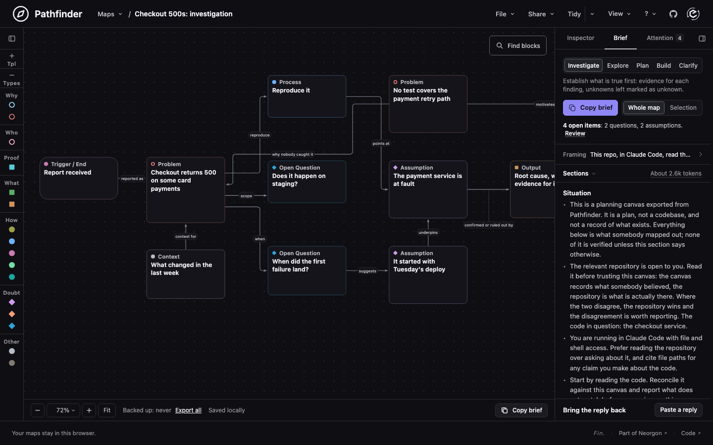

<div align="center">

# Pathfinder

Plan the work before an agent builds it.

[![Live][badge-site]][url-site]
[![HTML5][badge-html]][url-html]
[![CSS3][badge-css]][url-css]
[![JavaScript][badge-js]][url-js]
[![Claude Code][badge-claude]][url-claude]
[![License][badge-license]](LICENSE)

[badge-site]:    https://img.shields.io/badge/live_site-0063e5?style=for-the-badge&logo=googlechrome&logoColor=white
[badge-html]:    https://img.shields.io/badge/HTML5-E34F26?style=for-the-badge&logo=html5&logoColor=white
[badge-css]:     https://img.shields.io/badge/CSS3-1572B6?style=for-the-badge&logo=css3&logoColor=white
[badge-js]:      https://img.shields.io/badge/JavaScript-F7DF1E?style=for-the-badge&logo=javascript&logoColor=black
[badge-claude]:  https://img.shields.io/badge/Claude_Code-CC785C?style=for-the-badge&logo=anthropic&logoColor=white
[badge-license]: https://img.shields.io/badge/license-MIT-404040?style=for-the-badge

[url-site]:   https://pathfinder.neorgon.com/
[url-html]:   #
[url-css]:    #
[url-js]:     #
[url-claude]: https://claude.ai/code

</div>

<picture>
  <source media="(prefers-color-scheme: light)" srcset="docs/screenshot-light.png">
  
</picture>

1. **Map** the work as typed blocks: goals, stakeholders, metrics, requirements, work, risks, assumptions and open questions, connected by what each one means for the next.
2. **See the gaps** the plan has not addressed: a goal with nothing under it, a risk nothing mitigates, a requirement with no way to tell it is done.
3. **Hand over a brief** that front-loads all of it for Claude Code, Cursor or any assistant, then fold the reply back into the map.

```bash
make dev    # http://localhost:8807, with caching off
```

It runs entirely in the browser: no account, no backend, nothing uploaded. It also speaks
JSON Canvas (Obsidian) and Mermaid, so a plan can arrive from a vault or a README and live
back in one. New here? [Take the walkthrough](https://pathfinder.neorgon.com/tutorial.html),
or open one of the [examples](https://pathfinder.neorgon.com/examples.html).

The pictures here, the share card and the example maps are drawn by the app itself:
`make assets` redraws them (headless Chrome, `tools/render-assets.mjs`).

---

## Workflow

### Phase 1: Build the map

Add blocks from the palette on the left, or double-click empty canvas to add one where you clicked. Each block type carries a specific meaning (see the table below). Draw connections by dragging from the small port circles that appear on block edges when you hover; drop one on empty canvas, or just click a port, to add the next block there already connected.

The gap detection layer runs automatically and flags structural problems:

- A **goal** with no requirements linked (how will you get there?)
- A **problem** with no outgoing arrow and no "Resolve" action (what are you doing about it?)
- An **assumption** not anchored to a goal or requirement (unanchored assumptions compound)
- A **risk** with nothing downstream and no "Prepare" action (what mitigates it?)
- A **decision** with nothing leading to it and no rationale (why was this chosen?)
- An **output** nothing produces, or (once the map has a stakeholder or metric) that nobody receives
- A **requirement** with no acceptance criteria ("done" is undefined), and a **metric** with no target
- **Implementation** work with no reason on the map, a **metric** that measures no goal, and a **stakeholder** nothing is delivered to
- A workflow **step** wired into no flow, and any block with zero connections at all

Each block reports one gap at a time, as a ring and a small line icon on the
card. A gap you mean to keep can be accepted (the inspector's Suggestions, or
the Attention tab): it stops being raised and the prompt lists it under
"Accepted gaps" instead. Whole-canvas checks (no Goal or Problem, untyped
blocks, likely duplicates, a question hidden in a description) sit in the
Attention tab.
- Canvas-wide: circular dependency orders and named groups with no members

Each flagged block gets plain-language suggestions in the inspector, several with
a one-click fix, and the Prompt tab lists every firing rule with a jump to the
first offender.

The gap icons are not mandatory warnings. They are conversation starters: the canvas asking you to articulate things you might otherwise assume.

### Phase 2: Generate the brief

Switch to the **Prompt** tab in the right panel. The generated prompt assembles all blocks in a structured hierarchy, appends the connection graph, flags any remaining gaps, and applies any dev options you set (tone, detail level, acceptance criteria, security, TypeScript, etc.).

Paste the prompt as the first message to any AI. You get focused output because the assistant doesn't have to guess at your constraints.

---

## Block types

Sixteen types, grouped by the question each one answers. A map reads best
built in this order: **Why → Who → Proof → What → How → Doubt**. Proof comes
before How because the measure is set with the objective, and the work is
chosen after it.

| Step | Type | Dot | Use for |
|---|---|---|---|
| Why | **Goal** | blue ring `#9edaff` | What you want to achieve |
| Why | **Problem** | red ring `#dd7573` | An issue happening now |
| Who | **Stakeholder** | pink ring `#ffb1c8` | Who receives, approves or is affected |
| Proof | **Metric** | cyan square `#57cbd8` | A measurable signal with a target |
| What | **Requirement** | green square `#5aae69` | Must be true when done |
| What | **Output** | ochre square `#d1925a` | A deliverable someone can hold: report, doc, release |
| How | **Implementation** | olive dot `#9ea044` | Work done once to build or change something |
| How | **Process** | blue dot `#6cb3fd` | A recurring step in a workflow |
| How | **Trigger / End** | magenta dot `#cd7ab2` | What starts or ends a flow: an event, a cadence, a finish |
| How | **Decision** | mint dot `#73dea4` | A choice made, or one to make |
| How | **Resource / System** | teal dot `#1aa7a0` | An existing team, tool, system or data source |
| Doubt | **Assumption** | lilac diamond `#d09aea` | A belief you are treating as true |
| Doubt | **Risk** | orange diamond `#f89d79` | Something that might go wrong |
| Doubt | **Open Question** | sky diamond `#2fa5d8` | A genuine unknown |
| Other | **Context** | slate dot `#b7bcc6` | Background that frames the work |
| Other | **Other** | warm grey dot `#837a73` | Untyped: checks skip it |

The colour is the dark theme's; the light theme has a deeper twin of each
(DESIGN.md has both, in OKLCH). The dot's shape follows the step: a ring for
Why and Who, a square for What and Proof, a dot for How and Other, a diamond
for Doubt, so two types that look alike in colour never share a shape. Amber
on a card always means a gap, never a type.

Three pairs get confused, so the type picker says it outright: every time a
flow runs is a Process, once to build or change something is an
Implementation; a moment in time is a Trigger / End, a thing someone can hold
is an Output; a number with a target is a Metric (its targets go in
**Targets**).

All of this lives in one registry (`TYPES` in `js/utils.js`): the palette,
pickers, prompt, Markdown, Spec bundle, deck and meeting summary all read it,
and a test fails if any of them leaves a type out. Every type stays usable and
none is ever removed, because dropping a type would drop the blocks that use
it. A canvas from a newer build keeps a type this one does not know as Other,
with the original remembered, and an older label such as "Start / End" still
loads as its type.

**Card style.** The accent colour renders as a full border by default. Pick a
different look for the whole canvas from **View ▾ → Card style**, or override
one block from its inspector: Outline, Accent bar, Header, Tinted, or Plain.

**Action badges** (set in the Inspector) attach intent to any block:

| Badge | Icon | Meaning |
|---|---|---|
| `resolve` | wrench | You are actively working to fix this |
| `prepare` | shield | You need to set something up before proceeding |
| `recollect` | clock | You need to retrieve or recall information |
| `reinforce` | double chevron | You are strengthening or validating this point |
| `validate` | magnifier | You need to test this before relying on it |

Badges are neutral chips: the icon and the word tell them apart, never a colour (colour on a card means its type, a gap or the selection).

---

## Canvas interactions

| Action | How |
|---|---|
| Add block | Click any item in the palette, or right-click empty canvas |
| Add a connected block | Click a port, drop a port's line on empty canvas and pick a type, or `Alt + Arrow` |
| Move block | Drag the block body |
| Select block | Click once |
| Find a block | **Find blocks** on the canvas, or `Cmd/Ctrl + F`. Search content, then narrow by type or status |
| Add a block where you are | Double-click empty canvas and pick a type |
| Edit title | Double-click the card, or select it and press `Enter` (or `F2`). `Shift + Enter` edits the description |
| Draw arrow | Drag from a port circle on a block edge |
| Label a connection | Double-click it |
| Change where an arrow attaches | Select it, then pick a side under **Connection points**, or drag either endpoint handle |
| Auto-arrange everything | **Tidy** in the header, or `L`. One `Cmd/Ctrl+Z` undoes the whole arrangement |
| Change layout direction | Tidy's menu: arrange left to right, or top to bottom |
| Align a selection | Select two or more blocks, then use Align / Distribute in the inspector |
| Highlight for a presentation | Select blocks, pick a colour in the inspector. Spotlight fades the rest |
| Quick changes | Right-click a card, a connection, a selection or the canvas (`Shift + F10` from the keyboard) |
| Select every block of one type | Right-click a block, "Select all Problems" |
| Hide the header and footer | `H`. `Z` hides the side panels too |
| Delete selected | `Delete` or `Backspace` key |
| Duplicate block | `Cmd/Ctrl + D`, or Duplicate in the inspector's ⋯ menu |
| Pan canvas | Drag on empty canvas area, or scroll |
| Zoom | `Ctrl/Cmd` + scroll, or pinch. Scroll alone pans |
| Fit all blocks | `Shift + 1`, or **Fit** in the bar under the canvas |
| Deselect | Click empty canvas, or `Escape` |
| Every shortcut | `?` |

Search includes descriptions, notes, acceptance criteria, decision rationale,
questions, answers, and documentation labels. It shows matching excerpts, ranks
title matches first, and keeps every result available in a scrollable list.
Use the arrow keys and Enter to jump to a block, or Escape to close search.

---

## Inspector panel

Selecting a block opens its properties in the right panel:

- **Type**, **Status** and **⋯** (Duplicate, Delete) in one row at the top; the type is a dropdown grouped by the six steps
- **Title** and **Description**: also editable on the card itself
- **Actions**: the toggles that fit the type: Resolve on a problem, Prepare on a risk, Validate on an assumption (Recollect and Reinforce sit under Planning)
- **Acceptance criteria**, or **Targets** on a metric: the block's definition of done
- **Suggestions**: the block's gap, a fix for it, and **Accept** for a gap you mean to keep
- Closed until you open them: **Questions**, **Notes**, **Links and docs**, **Planning** (priority), and **Appearance** (colour, card style, border, highlight)

Every edit in the inspector is one undo step.

---

## Highlights

For the moment you share a canvas and five of its thirty boxes are the point.

Select some blocks, pick a colour: **Alert** (red), **Focus** (blue),
**Go** (green), **Hold** (grey), or **Festive** (a candy-cane border). Each is
a ring around the card with its word on a tab, so it never relies on colour
alone. Nothing moves by default; **View ▾ → Animate highlights** makes Alert
and Festive move on the card you hover or select, and never under reduced
motion. Right-click a block and choose **Select all Problems**
to mark a whole type in one action.

**Spotlight** fades everything that is not highlighted, which is where the drama
comes from: the contrast does the work, not the colour. Both travel with the
canvas through share links and the image export.

A highlight says "look here" and nothing more. The block type carries what a
block is, and priority and status carry where it stands, so highlights stay out
of the exported prompt on purpose.

## Situation

Before the goals, the prompt says where the tool is standing. Four choices in the
Prompt tab, and the panel shows you the exact lines they produce:

| Field | Options | Why it matters |
|---|---|---|
| Codebase | None yet, This repo, Elsewhere, Greenfield | With no code, every technical claim in the canvas is unverified and the prompt says so. With the repo open, the reader is told to read it and report where it disagrees with the canvas. |
| Running in | Chat, Claude Code, IDE | Whether the reader can actually reach files, and whether it may claim to have read them. |
| Start by | Reading the code, Asking questions, Proposing a plan, Getting to work | The first move, stated before the plan implies a different one. |
| Boundaries | Free text, one per line | What is out of bounds. |

This is the difference between a plan an assistant guesses at and one it acts on
correctly. It travels with the canvas through save, share, and export.

## Prompt builder

The **Prompt** tab generates a structured brief from the canvas state. It updates in real time as you edit blocks and connections.

**Dev Options** (collapsible):

| Option | Values |
|---|---|
| Tone | Auto, Formal, Casual, Technical |
| Detail level | Brief, Standard, Detailed |
| Pre-prompt flags | Tasks + acceptance criteria, Edge case handling, Error handling, Document key functions, Security implications, TypeScript types |

The generated prompt follows this structure (the section order depends on the
mode; every mode carries every block type):

```
## Situation
## Task
[selected dev options: tone, detail level, pre-prompt flags]
## Block Type Legend            (one line per type used, in step order)
---
# <canvas title>
## Engagement Context
## Context / Background
## Stakeholders (who this is for)
## Project Goals
## Success Metrics (how we will know)
## Problems / Blockers
## Requirements
## Work Items (implementation)
## Assumptions (validate before building)
## Risks
## Open Questions (Review Before Assuming)
## Decisions
## Resources Available
## Expected Outputs
## Workflow (end-to-end)
## Custom / Other
## Connections
• Implementation "Build the scheduler" [implied: produces] → Output "Weekly report"
## Planning Gaps Detected
## Accepted gaps
## When you reply
```

An unlabelled connection between two types that imply a verb prints it as
`[implied: ...]` (an Implementation satisfies a Requirement, a Metric measures
a Goal, an Output is delivered to a Stakeholder), marked so the reader knows
the tool inferred it. Gaps the author accepted are listed apart from the open
ones, so the assistant does not raise them again.

**Build mode** combines requirements, outputs and implementation work into one
dependency-ordered checklist, including connections through other block types. Priority chooses
between tasks whose prerequisites are already listed. Completed tasks remain
checked, blocked tasks remain labeled, and each task carries its notes,
questions and answers, criteria, and documentation reference. The spec bundle's
`tasks.md` uses the same checklist. A work item wired to a requirement lists
it as `satisfies:` with that requirement's acceptance criteria, instead of
asking for criteria of its own. Circular connections are flagged for review.

**Paste a reply or a review.** Paste an assistant's reply (or a reviewer's notes) into the Prompt tab to
preview its `pathfinder-patch`. Expand full before/after details and choose each
operation independently. Accepting a connection includes its new endpoint blocks;
excluding a new block excludes its connections. Apply the selection as one undo step.
Duplicate new block IDs and ambiguous references are rejected; repeated arrows
and criteria are deduplicated. If the canvas or active map changes after the
preview, review the refreshed preview before applying. The prompt's change
summary tracks answers, notes, criteria, status, connection text, and framing
since the last copy.

---

## Export and import

| Action | How |
|---|---|
| Copy prompt | Prompt tab → **Copy Prompt**, **Copy prompt** under the canvas, or File → Copy Prompt |
| Download JSON | File → **Download JSON**: full canvas state including block positions |
| Download Markdown | File → **Download Markdown**: one section per type, labelled connections, and a Mermaid graph that keeps every block and its type |
| Copy Mermaid | File → **Copy Mermaid**: the same graph on its own, for a README or an issue; it imports back with every type |
| Download JSON Canvas | File → **Download JSON Canvas**: a `.canvas` file for Obsidian, each node in its type's colour |
| Download Spec bundle | File → **Download Spec bundle**: spec.md (stakeholders, goals, metrics, requirements), plan.md, tasks.md (work items included), EARS requirements |
| Meeting summary | File → **Export Meeting Summary**: decisions, votes, actions, open questions, then every other type on the canvas |
| Import | File → **Import JSON / Canvas / Mermaid**: opens as a new map by default, or replaces or merges into the current one |

The JSON export preserves everything: block positions, connections, actions, questions, notes. Use it to save snapshots, share canvases with a team, or resume planning sessions.

View-only links and embeds load separately from your saved maps. They retain
their shared URL on reload, and viewing or panning them does not overwrite your
canvas or its saved camera.

The **Maps** menu keeps separate canvases and remembers each map's view. In
**Find blocks**, choose **All saved maps** to search across the library. Results
show their map name and open the matching block; the current map's unsaved edits
are included. Shared views search only the shared map.

**Attention** lists unanswered questions, unverified assumptions, blocked work,
and missing acceptance criteria. Filter by issue and open a block to resolve it.

Select a connection and set its **Meaning**: comes before, depends on, blocks,
informs, or related. Task checklists and cycle detection use this meaning.
“Depends on” orders the target first; informational links do not impose an order.
Older labeled connections infer their meaning; other older arrows retain their
drawn order. An explicit meaning takes precedence over a custom label.

**Maps → Snapshots → Compare** highlights added and changed blocks and draws
removed blocks as dashed outlines. The Changes list includes full before/after
content, connections, groups, and map settings. Comparison does not edit the map.
Restoring first saves a backup snapshot of the current work.

Zoom, save status, and **Copy prompt** share a compact bar below the canvas.
The copy action uses a standard copy icon and copies immediately. If browser
storage fails, the current
work stays open with **Retry save** and **Download backup** controls. Switching
maps waits for a successful save; the backup downloads the live content. The
backup control appears when saving fails; JSON export remains in File.

Both sidebars use matching panel controls. Sections use plus/minus buttons
with keyboard support. The optional session timer lives at the bottom of the
details panel, and its countdown appears after you start it.

---

## Architecture



```
pathfinder-site/
├── index.html              # App shell
├── css/
│   └── style.css           # All styles, variables, animations
├── js/
│   ├── app.js              # Entry point
│   ├── state.js            # State, localStorage, block mutations
│   ├── canvas.js           # Pan/zoom, ports, Bézier arrows
│   ├── render.js           # Block + inspector DOM rendering
│   ├── events.js           # Canvas pointer, keyboard shortcuts
│   ├── gaps.js             # Automatic gap detection
│   ├── prompt.js           # AI prompt builder
│   ├── ui-panels.js        # Export, search, dev options
│   └── utils.js            # Helpers
├── favicon.ico
└── CNAME                   # pathfinder.neorgon.com
```

State autosaves to `localStorage` key `pathfinder-v1` on every change (debounced 300 ms), with a copy in the active map's library slot. Each map's pan and zoom are saved separately and restored on reload or when switching maps. Shared links fit to their own content.

To run the browser test suite, start the local server and open
`/tests/run-tests.html`. The runner restores the browser's existing Pathfinder
storage after the tests finish.

---

<div align="center">
  <sub>Part of <a href="https://neorgon.com">Neorgon</a></sub>
</div>
